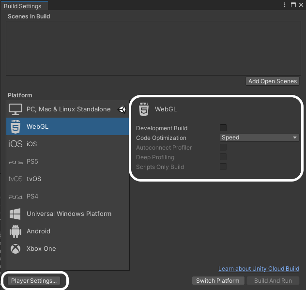
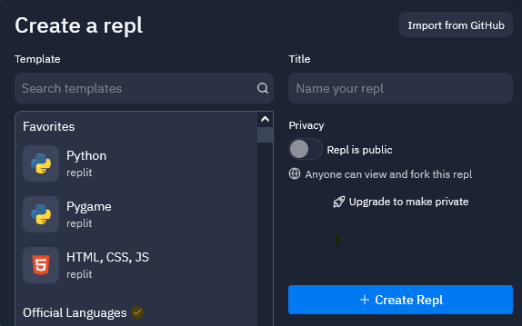

## Compartir proyectos de Unity

Cuando tu proyecto esté completo, podrás compartirlo con tus amigos o familiares.

Si es la primera vez que compartes un proyecto, debes cambiar la configuración de compilación.

Haz clic en el menú **Archivo** y selecciona **Configuración de compilación...**.

En la siguiente pantalla, selecciona **WebGL** y haz clic en la opción **Instalar con Unity Hub**.

En la siguiente pantalla, haz clic en el botón **Instalar** y luego espera a que se instale el módulo WebGL.

Una vez que el módulo se haya instalado, puedes cerrar Unity Hub, y luego cerrar Unity y reiniciarlo.

Una vez que Unity se haya vuelto a abrir, verifica que **Configuración de compilación...** del menú **Archivo** se haya actualizado y muestre que WebGL se ha instalado. Luego haga clic en el botón **Configuración del jugador...**.

En el menú de Reproductor de la izquierda, en el menú plegable para la configuración de publicación, seleccione **Desactivado** de las opciones de formato de compresión.

Cierra la ventana de configuración y haz clic en el botón **Construir y ejecutar**, luego elige dónde quieres guardar tu proyecto construido. Esto tomará unos minutos en tu primera ejecución, pero será más rápido en las siguientes compilaciones.

Tu juego debería abrirse automáticamente en tu navegador web predeterminado, y poder jugarse.

Para compartir tu proyecto, necesitas subirlo a un servidor web. Hay muchas maneras de hacer esto, pero una de las más simples es usar [repl.it](https://replit.com).

Abre repl.it en tu navegador web e inicia una sesión o regístra una cuenta si no tienes una.

Elije crear un proyecto **HTML, CSS, JS** dale un nombre a tu proyecto y haz clic en el botón **Crear Repl**.

Utiliza los tres menús de puntos para eliminar todos los archivos del proyecto.

Ahora puedes arrastrar y soltar todos tus archivos de compilación en tu proyecto repl.it.

Haz clic en el botón **Ejecutar** y deberías ver tu juego corriendo en la ventana de salida.

En la parte superior de la ventana de salida, verás una URL. Esta es la URL de tu juego; puedes compartirla con la gente.

  <iframe allowtransparency="true" width="500" height="400" src="https://sharegame.marcscott.repl.co/" frameborder="0"></iframe>

