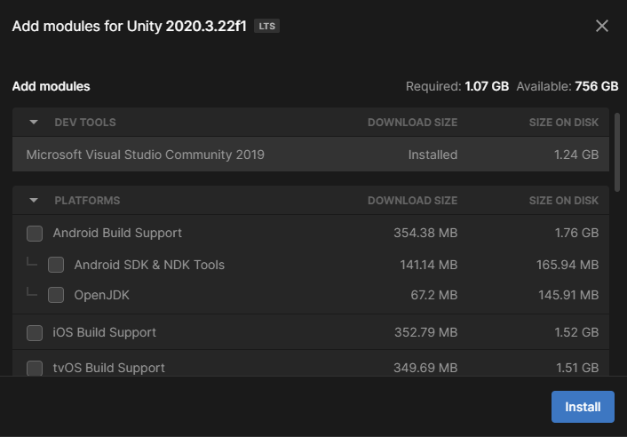
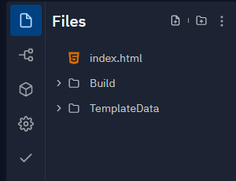
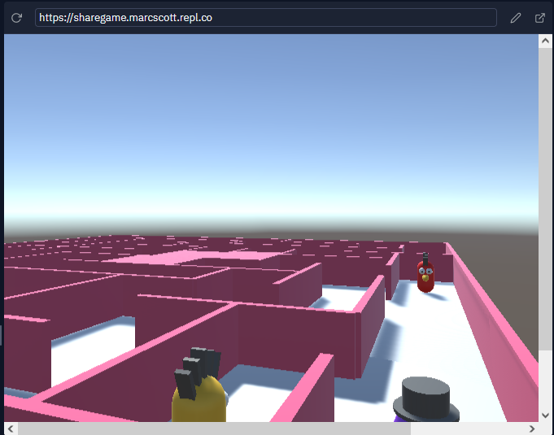

## Partager des projets Unity

Lorsque ton projet est terminé, tu peux le partager avec tes amis ou ta famille.

Si c'est la première fois que tu partages un projet, tu dois modifier tes paramètres de build.

Clique sur le menu **File** et sélectionne **Build Settings...**.

Sur l'écran suivant, sélectionne **WebGL** et clique sur l'option **Install with Unity Hub**.

Sur l'écran suivant, clique sur le bouton **Install**, puis attends que le module WebGL soit installé.

Une fois le module installé, tu peux fermer Unity Hub, puis fermer Unity et le redémarrer.

Une fois Unity rouvert, vérifie que **Build Settings...** du menu **File** a été mis à jour, et montre que WebGL a été installé. Clique ensuite sur le bouton **Player Settings...**.

Dans le menu Player sur la gauche, dans le menu déroulant pour Publishing Settings, sélectionne **Disabled** dans les options Compression Format.

Ferme la fenêtre des paramètres, puis clique sur le bouton **Build And Run**, puis choisis où tu souhaites enregistrer ton projet créé. Cela prendra quelques minutes lors de la première exécution, mais sera plus rapide pour les builds suivants.

Ton jeu devrait s'ouvrir automatiquement dans ton navigateur Web par défaut et être jouable.

Pour partager ton projet, tu dois le télécharger sur un serveur Web. Il existe plusieurs façons de procéder, mais l'une des plus simples consiste à utiliser [repl.it](https://replit.com).

Ouvre repl.it dans ton navigateur Web et connecte-toi ou crée un compte si tu n'en as pas.

Choisis de faire un projet **HTML, CSS, JS**, puis donne un nom à ton projet et clique sur le bouton **Create Repl**.

Utilise les menus à trois points pour supprimer tous les fichiers du projet.

Tu peux maintenant faire glisser et déposer tous tes fichiers de build dans ton projet repl.it.

Clique sur le bouton **Run** et tu devrais voir ton jeu en cours d'exécution dans la fenêtre de sortie.

En haut de la fenêtre de sortie, tu verras une URL. Il s'agit de l'URL de ton jeu ; tu peux partager cela avec les gens.

  <iframe allowtransparency="true" width="500" height="400" src="https://sharegame.marcscott.repl.co/" frameborder="0"></iframe>

