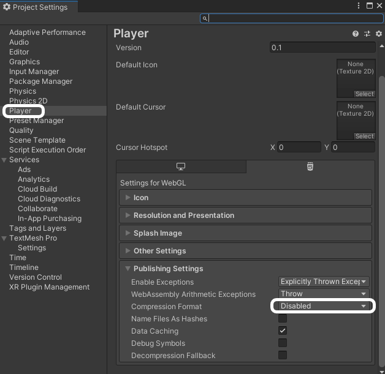
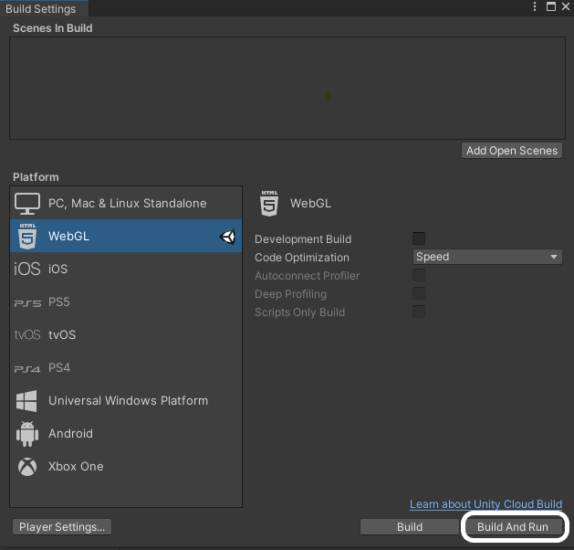

## Unity projecten delen

Wanneer je project af is, kun je het delen met je vrienden of familie.

Als dit de eerste keer is dat je een project deelt, moet je je build-instellingen wijzigen.

Klik op het **File** menu en selecteer **Build Settings...**.

Selecteer in het volgende scherm **WebGL** en klik op de optie **Install with Unity Hub**.

Klik in het volgende scherm op de knop **Install** en wacht tot de WebGL-module is geïnstalleerd.

Zodra de module geïnstalleerd is, kun je Unity Hub sluiten en daarna Unity sluiten en opnieuw starten.

Nadat Unity opnieuw is geopend, controleer je of de **Build Settings...** in het **File** menu zijn bijgewerkt en dat WebGL is geïnstalleerd. Klik vervolgens op de knop **Player Settings...**.

Selecteer in het menu Player aan de linkerkant in het inklapbare menu voor Publishing Settings, **Disabled** bij de Compression Format opties.

Sluit het settings venster en klik vervolgens op de **Build and Run** -knop, en kies vervolgens waar je je project wil opslaan. Dit duurt een paar minuten tijdens je eerste run, maar zal sneller zijn bij volgende builds.

Je game zou automatisch moeten openen in je standaard webbrowser en speelbaar moeten zijn.

Om jouw project te delen, moet je het uploaden naar een webserver. Er zijn veel manieren om dit te doen, maar een van de eenvoudigste is om [repl.it](https://replit.com) te gebruiken.

Open repl.it in je webbrowser en meld je aan of maak een account aan als je er nog geen hebt.

Kies om een **HTML, CSS, JS** project te maken, geef je project dan een naam en klik op de **Create Repl** knop.

Gebruik het menu met drie stippen om alle bestanden in het project te verwijderen.

Je kunt nu al je build-bestanden naar je repl.it-project slepen en neerzetten.

Klik op de knop **Run** en je zou je spel in het output window moeten zien draaien.

Aan de bovenkant van het output window zie je een URL. Dit is de URL van je spel; je kunt deze delen met andere mensen.

  <iframe allowtransparency="true" width="500" height="400" src="https://sharegame.marcscott.repl.co/" frameborder="0"></iframe>

