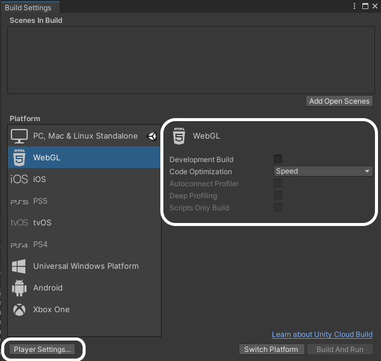

## Sharing Unity projects

When your project is complete, you can share it with your friends or family.

If this is your first time sharing a project, you need to change your build settings.

Click on the **File** menu and select **Build Settings...**.

On the next screen, select **WebGL** and click on the **Install with Unity Hub** option.

On the next screen, click the **Install** button, then wait for the WebGL module to be installed.

Once the module has installed, you can close Unity Hub, and then close Unity and restart it.

Once Unity has re-opened, check that the **Build Settings...** from the **File** menu have been updated, and show that WebGL has been installed. Then click on the **Player Settings...** button.

From the Player menu on the left, in the collapsible menu for Publishing Settings, select **Disabled** from the Compression Format options.

Close the settings window and then click on the **Build And Run** button, then choose where you want to save your built project. This will take a few minutes on your first run, but will be quicker on following builds.

You game should automatically open in your default web browser, and be playable.

To share your project, you need to upload it to a web server. There are many ways of doing this, but one of the simplest is to use [repl.it](https://replit.com).

Open repl.it in your web browser, and either sign in, or sign up for an account if you don't have one.

Choose to make an **HTML, CSS, JS** project, then give your project a name and click the **Create Repl** button.

Use the three dot menus to Delete all the files in the project.

You can now drag and drop all your build files into your repl.it project.

Click on the **Run** button and you should see your game running in the output window.

At the top of the output window, you will see a URL. This is the URL of your game; you can share this with people.

  <iframe allowtransparency="true" width="500" height="400" src="https://sharegame.marcscott.repl.co/" frameborder="0"></iframe>

